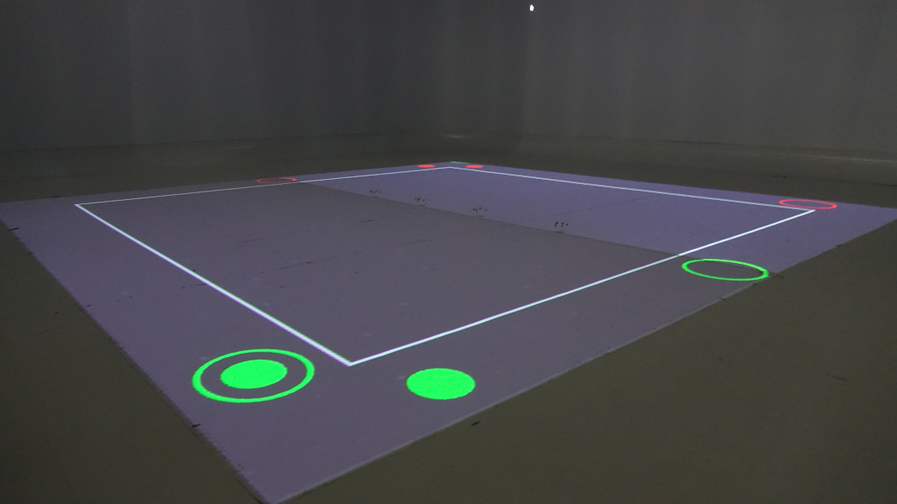
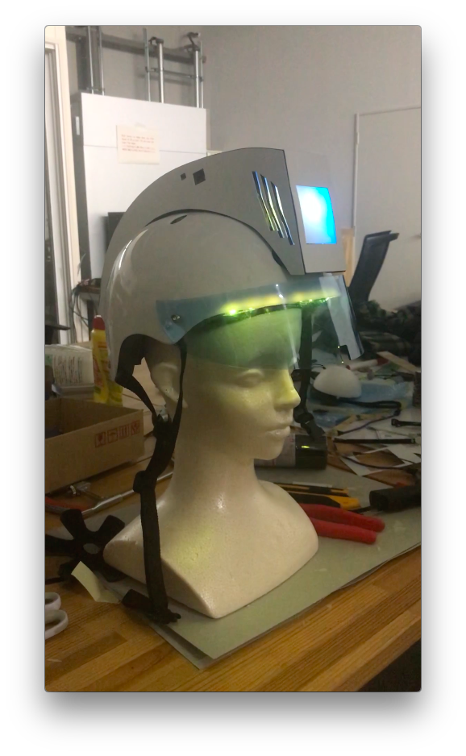
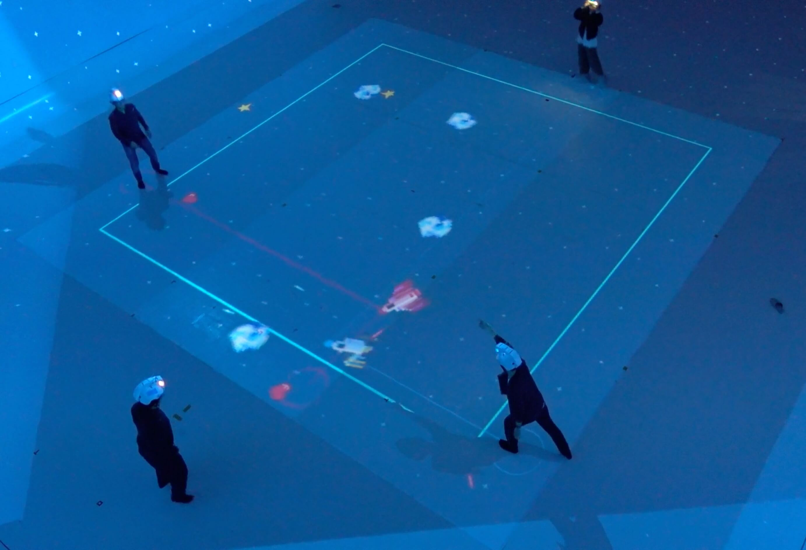
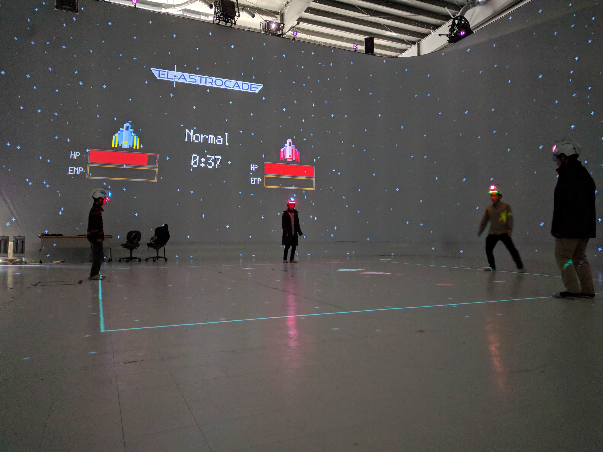

We, the authors, proposed a shooting game based on whole body motion as part of a
student project. Over the course of 12 months we ran through multiple iterations
of designing the appearance and interactions within the game. The core elements
of the finalized version are motion tracking and a helmet with haptic and visual
feedback.

First iteration of the game projection:

The helmet (picture below) is used to present haptic feedback when the spaceships
receive damage through lasers or by collision with asteroids. When the ship gets
hit a LED strip below the visor flashes red. The rest of the time the LED strip
fades from green to red to indicate the life points of the spaceship. A display
at the front of the helmet shows the team color. Motion tracking markers on top
of the hemet (not in the picture) are used to track the position of the players.

The body position (x,y,z) of 2 teams with 2 players each is measured to give
shared control over a spaceship to each team. One player of each team controls
the X and Y direction of the ship. The players height controls the ships actions.
At the beginning of each game the height of the players is picked up. The ship
can shoot a laser when either of the team members jumps or activate a shield for
defense when one player of the team squats during the game.

This game is entirely written in C++ with [openFrameworks](https://www.openframeworks.cc)
and was developed for the [Large Space](http://intron.kz.tsukuba.ac.jp/archives/788)
at the University of Tsukuba. The game graphics are projected on a 5 by 5 meter
floor area and players move along the sides of the projection.

This final system increases physical activity of all players thanks to the body
motion control and fosters teamwork through shared control of the spaceship.

The source code might be released on www.github.com/felixdollack at a later point
after cleaning it a little.

Project status: finished.
