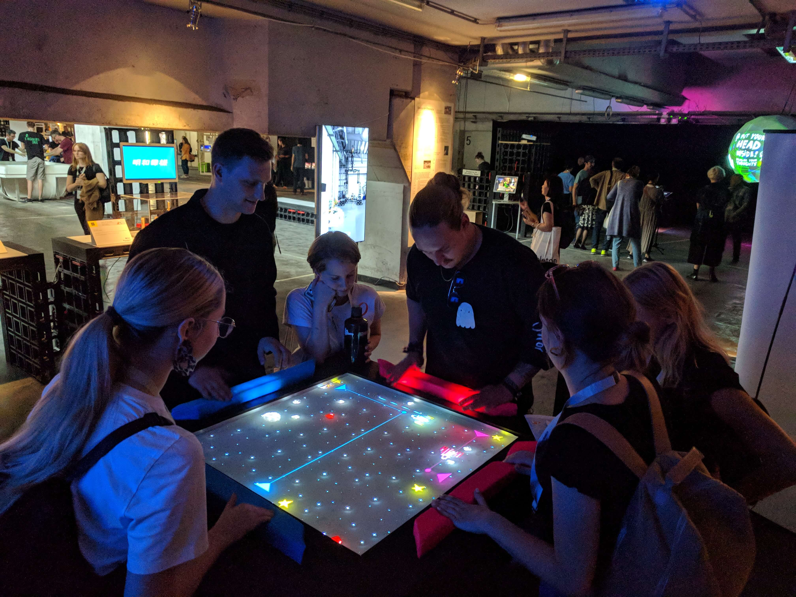

The original version of [El Astrocade](../elastrocade/) was limited due to hardware
necessities. For better portability El Astrocade 2 was an attempt to minify the
original game while keeping most of the control aspects the same.

An aluminum frame box with a acrylic display used to project the game from below
was created. The final length of each side of the table was too short to make
players walk. Therefore, we opted for balance control using WiiFit balance boards.
Shifting weight to the left or right side controlled the movement of the spaceship.
Leaning backward on the balance board triggered the shield for defense against damage.

The balance board has a weight limit, so we had to rethink the jump action to
trigger shooting. We decided to build very soft buttons to trigger a shot.
The buttons sense touch by infrared light refraction measured with custom PCB boards
on the inside. Every touch was reflected with a light animation inside the button.

The work was exhibited during the 5-day lasting [Ars Electronica Festival 2019]
in Linz, Austria. It was well received and a magnet for approximately 1000
visitors a day. The total down-time during the exhibition was less than 5 minutes.

The source code might be released on www.github.com/felixdollack at a later point
after cleaning it a little.

Project status: finished.

[Ars Electronica Festival 2019]: https://ars.electronica.art/outofthebox/en/
